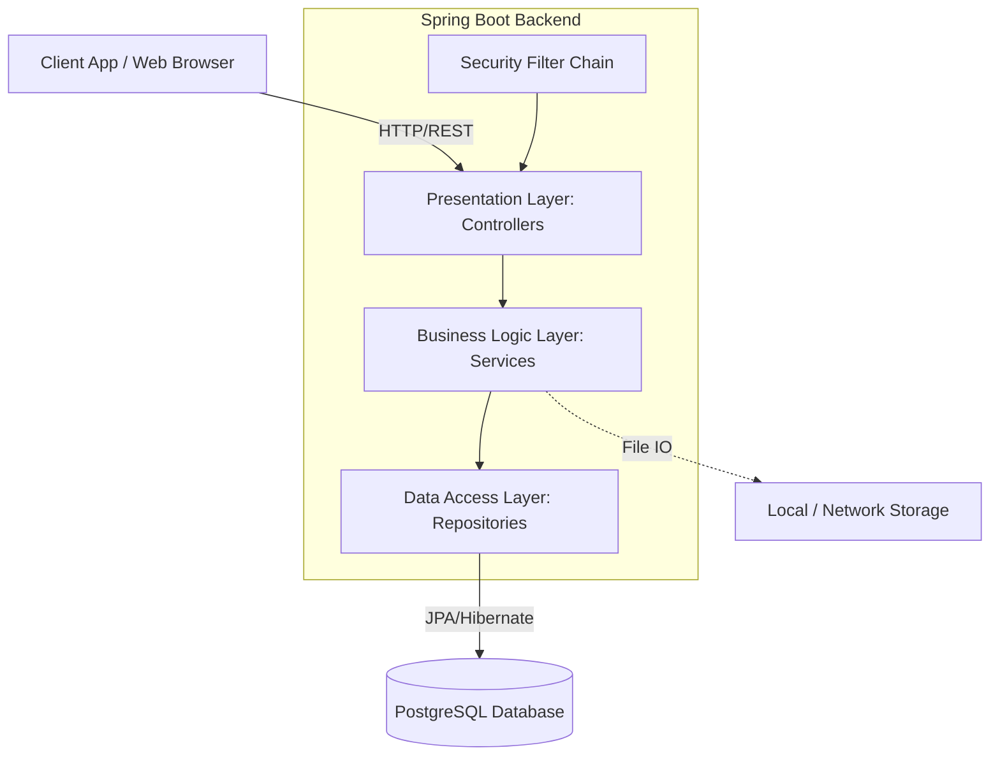

# 03 시스템 아키텍처 설계 (System Architecture)

## 1. 개요
이 문서는 MarkDown Note System 백엔드의 구성 요소, 기술 스택, 레이어 구조 및 보안 아키텍처를 정의한다.

## 2. 기술 스택 (Technology Stack)
* **언어**: Java 17
* **프레임워크**: Spring Boot 3.2.0
* **데이터베이스**: PostgreSQL (운영), H2 (테스트용 인메모리)
* **ORM/데이터 접근**: Spring Data JPA
* **보안/인증**: Spring Security, JWT (io.jsonwebtoken 0.11.5)
* **API 문서화**: SpringDoc OpenAPI (Swagger UI) 2.2.0

## 3. 시스템 논리적 아키텍처 (Logical Architecture)
시스템은 일반적인 3-Tier 아키텍처 패턴을 따르며 책임의 분리를 강조한다.

### 3.1 계층별 역할 (Layer Responsibilities)
1. **Presentation Layer (Controllers)**:
   - 클라이언트의 HTTP REST 요청 수신 (URI: `/api/v1/*`, `/api/documents/*` 등).
   - 페이로드 검증 및 적절한 HTTP 상태 코드(응답) 반환.
2. **Business Logic Layer (Services)**:
   - 핵심 도메인 규칙 수행 (예: `DocumentService`의 문서 권한 평가).
   - 트랜잭션 관리(`@Transactional`) 수행.
3. **Data Access Layer (Repositories)**:
   - Spring Data JPA 인터페이스 패턴을 사용한 영속성(Persistence) 보장.
   - 쿼리 메서드 및 Pagination(`Pageable`) 연동 로직 포함.

## 4. 인증 및 보안 아키텍처 (Security Architecture)

### 4.1 인증 모드 스위칭
환경변수(`app.auth.type`) 설정에 따라 2가지 인증 모드를 동적으로 지원하여 개발 효율성을 높인다.
* **JWT 모드 (`jwt`)**: `JwtAuthFilter` 활성화. 운영 환경에서 JWT의 유효성을 검증해 `Principal`을 주입.
* **단순(Simple) 모드 (`simple`)**: `DevAuthFilter` 활성화. 개발/테스트 시 Authorization 헤더의 평문 사용자명을 파싱하여 세션을 부여함. (admin 접속 시 자동 권한 부여 등)

### 4.2 인가 체계 (Authorization)
* **Role-based Access Control (RBAC)**: `/api/admin/**` 등급의 관리 엔드포인트는 `ROLE_ADMIN`을 소유한 사용자만 접근 가능.
* **Resource-based Access Control 전략**: 문서 읽기/수정의 경우, `DocumentService` 내부 데이터에 접근할 때 작성자 동일 여부 및 Public/Group 접근 허용 여부를 DB 플래그 기준으로 판별한다.

## 5. 데이터 패러다임
### 5.1 계층형 데이터 모델
* **자기 참조 구조(Self-Referencing)**: `Category` 및 `Department` 엔티티는 트리 형태로 관리되도록 `parent_id` (외래키)를 자기 자신 엔티티에 맵핑한다.
* 이는 스레드나 대주제-소주제 구조를 확장성 있게 관리하기 위한 기반을 제공한다.

### 5.2 파일 스토리지 (File Storage)
* 물리적 파일은 DB에 직접 저장하지 않고, `FileStorageService`를 통해 서버의 파일 시스템(기본값: `/uploads` 등)에 저장된다.
* 파일명의 충돌 방지를 위해 UUID 등으로 변환하여 저장하되(Physical Name), 사용자 제공 시 본래 이름(Logical Name)으로 제공된다.
