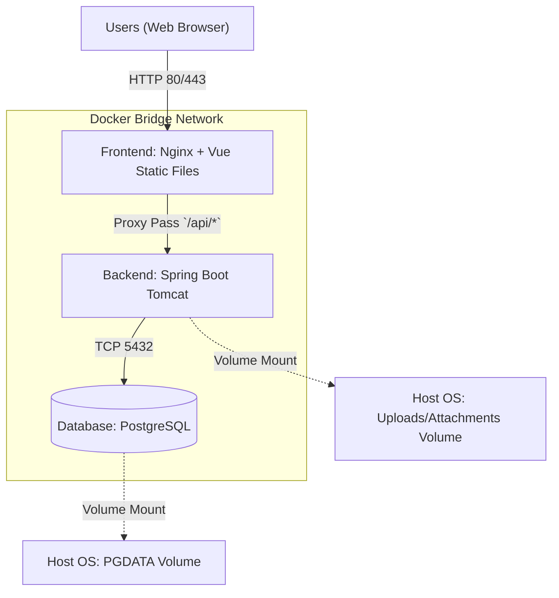

# 06 배포 및 인프라 설계서 (Deployment & Cloud Architecture)

## 1. 개요 (Overview)
본 문서는 MarkDown Note System을 로컬 혹은 프로덕션(운영) 환경에 배포하기 위한 Docker 기반의 인프라 구성 및 CI/CD 파이프라인 전략을 정의합니다. 전체 시스템은 Vue 프론트엔드, Spring Boot 백엔드, PostgreSQL 데이터베이스의 3-Tier 컨테이너 구조로 관리됩니다.

---

## 2. 배포 아키텍처 (Deployment Architecture)



### 핵심 컴포넌트
1. **Frontend (Nginx 컨테이너)**:
   * Vue 3(Vite) 앱 빌드 결과물(정적 HTML/JS/CSS) 서빙.
   * 리버스 프록시(Reverse Proxy) 역할을 겸하여 `/api` 로 시작하는 요청을 백엔드 컨테이너로 라우팅.
2. **Backend (Spring Boot 컨테이너)**:
   * REST API 제공 및 비즈니스/보안 로직 처리.
   * JDBC를 통해 내부망의 PostgreSQL과 직접 통신.
   * 컨테이너 내부의 `/app/uploads` 디렉터리와 호스트 OS의 스토리지를 마운트하여 첨부파일(이미지 등)의 무결성 보장.
3. **Database (PostgreSQL 컨테이너)**:
   * 트랜잭션, 사용자 데이터, 문서 텍스트 저장.
   * 데이터 영속성(Persistence)을 위해 Named Volume 활용.

---

## 3. 컨테이너 패키징 규격 (Containerization)

### 3.1 Frontend (`Dockerfile`)
* **Multi-stage 빌드** 적용으로 이미지 크기 최소화.
```dockerfile
# Stage 1: Build Vue App
FROM node:20-alpine AS builder
WORKDIR /app
COPY package*.json ./
RUN npm ci
COPY . .
RUN npm run build

# Stage 2: Serve via Nginx
FROM nginx:alpine
# Copy built static files
COPY --from=builder /app/dist /usr/share/nginx/html
# Copy custom nginx conf (for proxy_pass to backend)
COPY nginx.conf /etc/nginx/conf.d/default.conf
EXPOSE 80
CMD ["nginx", "-g", "daemon off;"]
```

### 3.2 Backend (`Dockerfile`)
* 소스코드 변경에 유연하게 대응하기 위한 Gradle/Maven 멀티 스테이지 빌드.
```dockerfile
# Stage 1: Build JAR
FROM eclipse-temurin:17-jdk-alpine AS builder
WORKDIR /workspace
COPY gradlew .
COPY gradle gradle
COPY build.gradle settings.gradle ./
COPY src src
RUN ./gradlew bootJar --no-daemon

# Stage 2: Runtime
FROM eclipse-temurin:17-jre-alpine
WORKDIR /app
# 호스트 OS와 연결할 마운트 포인트 생성
RUN mkdir -p /app/uploads
COPY --from=builder /workspace/build/libs/*.jar app.jar
EXPOSE 8080
# Profile: prod
ENTRYPOINT ["java", "-Dspring.profiles.active=prod", "-jar", "app.jar"]
```

---

## 4. 오케스트레이션 구성 (`docker-compose.yml`)

로컬 개발/스테이징/라이브 환경을 손쉽게 세팅할 수 있는 Compose 템플릿입니다.

```yaml
version: '3.8'

services:
  db:
    image: postgres:15-alpine
    container_name: mdnote_db
    environment:
      POSTGRES_USER: ${DB_USER:-mdnote}
      POSTGRES_PASSWORD: ${DB_PASS:-secret}
      POSTGRES_DB: mdnote_db
    ports:
      - "5432:5432"
    volumes:
      - pgdata:/var/lib/postgresql/data
    networks:
      - mdnote-network
    restart: unless-stopped

  backend:
    build:
      context: ./backend
      dockerfile: Dockerfile
    container_name: mdnote_backend
    environment:
      SPRING_DATASOURCE_URL: jdbc:postgresql://db:5432/mdnote_db
      SPRING_DATASOURCE_USERNAME: ${DB_USER:-mdnote}
      SPRING_DATASOURCE_PASSWORD: ${DB_PASS:-secret}
      JWT_SECRET: ${JWT_SECRET:-very_long_secret_key_for_md_note_system_2026}
    ports:
      - "8080:8080"
    volumes:
      # 물리 파일 저장 공간 마운트
      - app_uploads:/app/uploads 
    depends_on:
      - db
    networks:
      - mdnote-network
    restart: on-failure

  frontend:
    build:
      context: ./frontend
      dockerfile: Dockerfile
    container_name: mdnote_frontend
    ports:
      - "80:80"
    depends_on:
      - backend
    networks:
      - mdnote-network
    restart: always

networks:
  mdnote-network:
    driver: bridge

volumes:
  pgdata:
  app_uploads:
```

### 4.1 핵심 설정 (`.env` 관리)
보안이 요구되는 민감한 환경 변수는 GitHub에 커밋하지 않고 호스트 장비의 `.env` 파일로 주입합니다.
* `DB_PASS`: 프로덕션용 난수화된 패스워드.
* `JWT_SECRET`: HS256 알고리즘에서 사용할 강력한 서명 키.

---

## 5. 지속적 통합 및 배포 파이프라인 (CI/CD Pipeline)

운영 환경(Production)의 무중단 배포 및 자동화 흐름은 다음과 같이 추천합니다. (예: GitHub Actions 기준)

1. **[CI] Branch Push (PR)**: 
   - 프론트엔드/백엔드 폴더 내에서 `npm run test:unit`, `gradlew test` 트리거. 통과 실패 시 병합 차단.
2. **[CI] Build Container Image**: 
   - `main` 브랜치 병합 시 GitHub Actions Runner가 `docker build`를 실행.
3. **[CD] Push to Registry**: 
   - 생성된 이미지를 Docker Hub 플랫폼 또는 ECR(AWS)에 태깅(버전, 깃 해시) 후 푸시.
4. **[CD] Server Deploy**: 
   - 운영 서버에 Webhook/SSH를 통해 이벤트를 쏘고, 서버에서 최신 이미지를 `docker-compose pull && docker-compose up -d` 방식으로 교체. 

*(대규모 트래픽 발생 시 AWS ECS, EKS 또는 K8s 매니페스트를 통한 배포를 추가로 고려할 수 있습니다.)*

---

## 6. 배포 스크립트 실행 가이드 (Execution Guide)

위에서 정의한 `docker-compose.yml` 리소스를 활용하여 실제 서버 혹은 로컬 PC에 시스템을 띄우고 내리는 명령어 모음입니다.

### 6.1 환경변수 세팅
프로젝트 최상단(루트) 디렉터리에 `.env` 파일을 먼저 생성해야 합니다.
```bash
# .env 파일 생성 및 예시 (Linux/Mac 환경)
cat << 'ENVE' > .env
DB_USER=mdnote
DB_PASS=secure_mdnote_db_password_123!
JWT_SECRET=super_secret_jwt_key_that_is_at_least_256_bits_long
ENVE
```

### 6.2 서비스 구동 (Spin-up)
최신의 프론트엔드/백엔드 코드를 기반으로 이미지를 새로 빌드하고 백그라운드에서 컨테이너를 올립니다.
```bash
# 이미지 빌드 및 컨테이너 데몬(백그라운드) 실행
docker-compose up --build -d
```
> 구동이 완료되면 `http://localhost:80` (Nginx)을 통해 브라우저에서 웹 시스템에 접속할 수 있습니다. 백엔드 API는 `http://localhost:80/api` 형태로 프록시됩니다.

### 6.3 로그 확인 (Monitoring Logs)
컨테이너들의 구동 상태나 애플리케이션 에러를 확인할 때 사용합니다.
```bash
# 전체 서비스의 실시간 로그 모두 확인 (종료: Ctrl + C)
docker-compose logs -f

# 특정 서비스(예: 백엔드 스프링 부트) 로그만 확인
docker-compose logs -f backend
```

### 6.4 서비스 종료 및 초기화 (Tear-down)
업데이트나 점검을 위해 시스템을 내립니다.
```bash
# 컨테이너 종료 및 네트워크 해제 (볼륨 데이터는 유지됨)
docker-compose down

# (주의) DB 데이터와 업로드된 파일을 포함하여 모든 볼륨까지 완전 초기화 (개발망 초기화 용도)
docker-compose down -v
```
